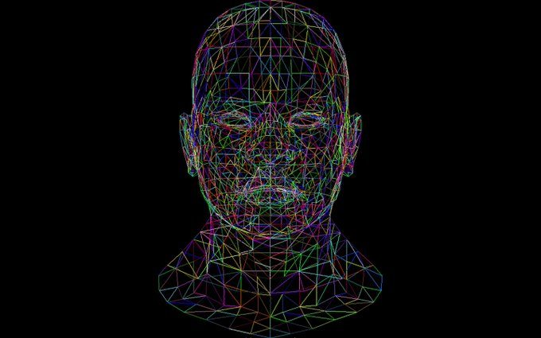
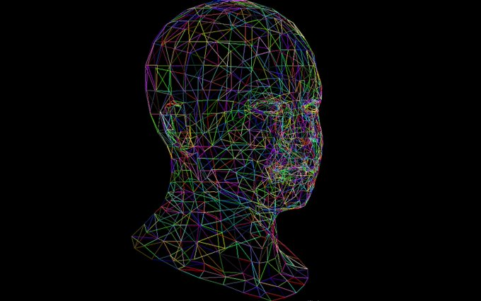
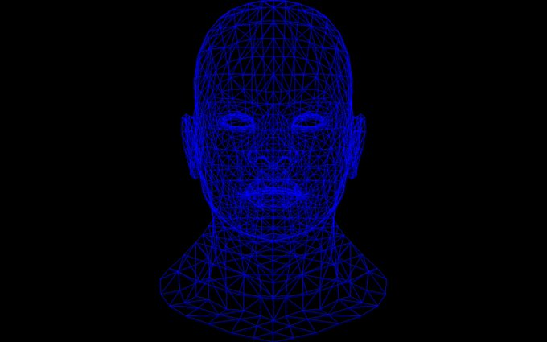
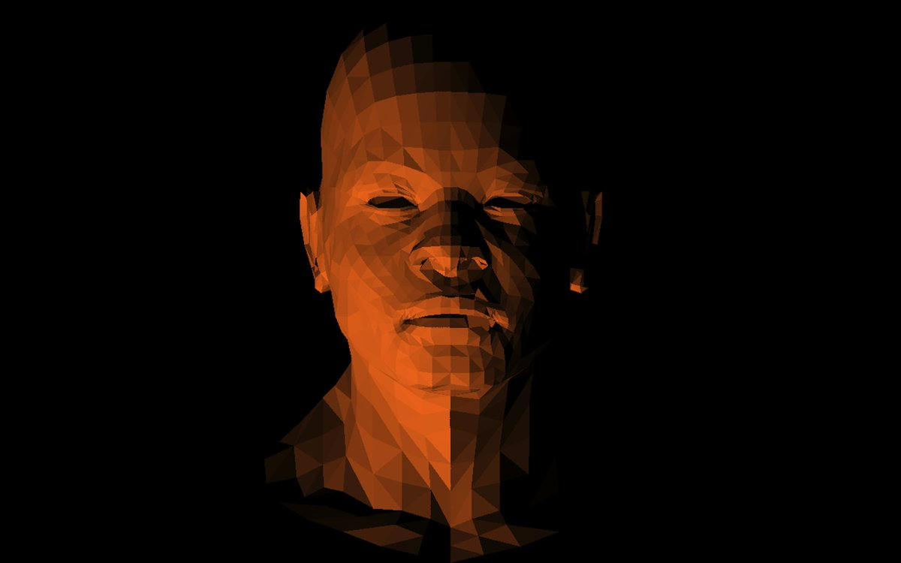
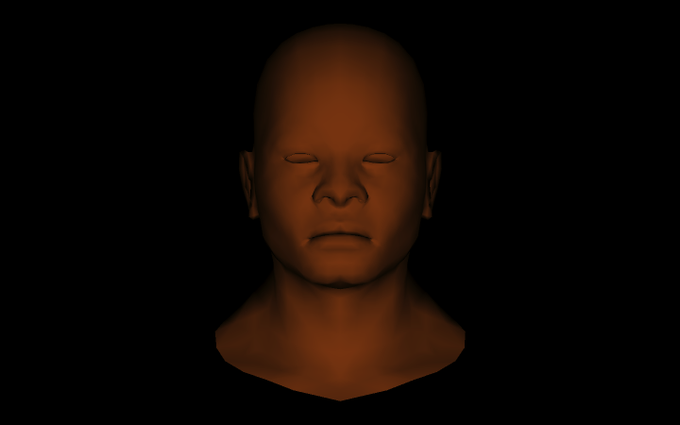
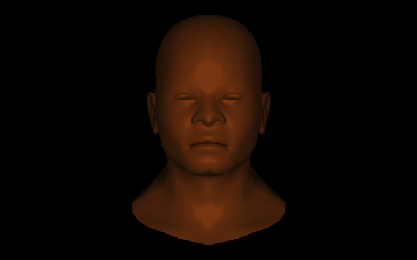
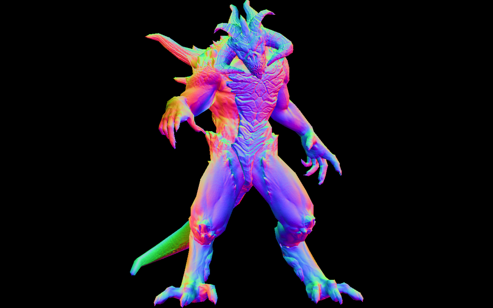

# TinyRenderer

A minimal software rasterizer in C++

## Features

- Supports flat, Gouraud, and Phong shading
- Loads `.obj` models and `.tga` textures
- Outputs rendered images

## Sample Outputs

Wireframes:
<table>
  <tr> 
    <td>Wireframe</td>
    <td>Wireframe</td>
    <td>Wireframe</td>
  </tr>
<tr>
    <td></td>
    <td></td>
    <td></td>
  </tr>
</table>
<!-- Here are some sample outputs demonstrating different shading techniques: -->

<table>
  <tr>
    <td>Flat Shading</td>
    <td>Gouraud Shading</td>
    <td>Phong Shading</td>
  </tr>
  <tr>
    <td></td>
    <td></td>
    <td></td>
  </tr>
</table>

Diablo3 Character:

<div>
  
</div>

1.  Clone the repository:

    ```
    git clone https://github.com/Sachinkry/tinyrenderer.git
    cd tinyrenderer
    ```

2.  **Build the project using CMake:**

    ```
    mkdir build
    cd build
    cmake ..
    make
    ```

3.  **Run the executable:**

    ```
    ./main
    ```

## Dependencies

- A C++ compiler with C++17 support (e.g., g++)
- CMake (version 3.10 or higher)

## Notes

- The rendered images are saved in the `assets/outputs` directory.
- The `.vscode` directory and the `main` executable are ignored by Git (see `.gitignore`).

```
 g++ -std=c++17 -ggdb -g -pg -O0 -Iinclude -o main src/main.cpp src/tgaimage.cpp src/model.cpp src/shaders.cpp
```

```
./main
```
